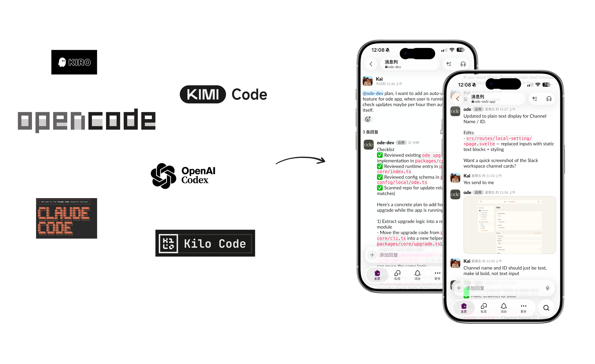
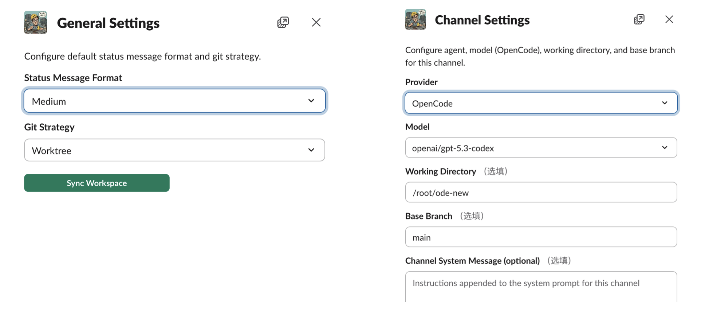

# Ode

[English](README.md)

Ode 是一个编程代理工具，可将你的编码Agent（OpenCode、Claude Code、Codex 等）连接到你常用的聊天应用中（Slack、Discord、Lark）。非常适合个人开发者或团队在移动场景下协作开发。



## 核心特性

* 🏖️ 随时随地编码，在 Slack 中聊天即可获得响应。
* 🖇️ **将编码会话与 Slack 线程 1:1 映射**，并结合 worktree 实现隔离开发，轻松并行协作。
* 👬 频道内任何人都可以直接参与编码，无需额外配置，**一个账号可供团队成员共享使用**。
* 📝 **消息实时更新**，不再盲等回复，你可以通过实时文本更新持续跟踪进度。
* 🐙 **按用户设置git信息**，由谁发起线程，就以谁作为对应提交作者。 (Run @bot /gh)

## 和OpenClaw的比较

* Ode专注于基于**线程**的消息列表，更适合编程或者需要管理不同任务的工作。一个线程只聚焦一件事。
* 支持**动态消息更新**、类Markdown文本渲染，Ode非常适合展示编码相关信息，给你更多的信心。
* **基于频道的设置**，可在同一台机器和同一个Slack工作区中轻松配置多个工作目录。
* 我们也希望后续支持尽可能多的聊天工具。


*Each thread is a session, each channel can setup different directories or coding tools/models*

## 安装与配置

### 前置要求

- 已配置 OpenCode / Claude Code / Codex / Kimi Code... 至少一个编码 CLI。
- 注册并配置一个启用了 Socket Mode 的 Slack Bot，获取其 APP TOKEN（xapp...）和 BOT TOKEN（xbot..）。
  - 如果你不太熟悉 Slack Bot 的配置与权限范围，可能会稍显复杂。可直接下载 [`slack-app-manifest.json`](https://raw.githubusercontent.com/odefun/ode/main/static/slack-app-manifest.json) 并通过 manifest 文件生成。

### 安装与运行

一行安装（macOS/Linux）：

```bash
curl -fsSL https://raw.githubusercontent.com/odefun/ode/main/scripts/install.sh | bash
```

```bash
ode
# 如果你想暴露设置页面，可使用 ODE_WEB_HOST=0.0.0.0 ode
```

设置界面可通过 http://127.0.0.1:9293 访问，或在 Slack 中使用 `/setting` 命令，例如 `@bot /setting`。

Lark 开放平台事件订阅回调地址可使用：`POST /api/lark/event`。
在 Lark 聊天里发送 `/setting` 可收到设置卡片并快速打开本地设置页面。
默认情况下，只要配置了 Lark 凭据，Ode 也会启动 Lark 长连接（WS）模式，因此本地测试不需要公网回调地址。可通过 `LARK_LONG_CONNECTION=false` 关闭。


*Run `@bot /setting` to trigger setting dialog.*

## 代理列表

| 代理 | Logo | Link |
| --- | --- | --- |
| OpenCode |  | [opencode.ai](https://opencode.ai/) |
| Codex |  | [github.com/openai/codex](https://github.com/openai/codex) |
| Claude Code |  | [docs.anthropic.com/claude-code](https://docs.anthropic.com/en/docs/claude-code/overview) |
| Kimi Code |  | [moonshotai.github.io/kimi-cli](https://moonshotai.github.io/kimi-cli/) |
| Qwen Code |  | [github.com/QwenLM/qwen-code](https://github.com/QwenLM/qwen-code) |
| Goose CLI |  | [block.github.io/goose](https://block.github.io/goose/) |
| Gemini CLI |  | [github.com/google-gemini/gemini-cli](https://github.com/google-gemini/gemini-cli) |
| Kilo Code |  | [kilo.ai/docs/code-with-ai/platforms/cli](https://kilo.ai/docs/code-with-ai/platforms/cli) |
| Kiro CLI |  | [kiro.dev/docs/cli/reference](https://kiro.dev/docs/cli/reference/cli-commands/) |

## 聊天应用列表

| 聊天应用 | Logo | Link |
| --- | --- | --- |
| Slack |  | [slack.com](https://slack.com/) |
| Discord |  | [discord.com](https://discord.com/) |
| 飞书（CN） |  | [www.larksuite.com](https://www.larksuite.com/) |

## 使用方式

1. 邀请机器人进入一个频道。
2. 执行 `@bot /setting`，选择频道设置，选择你的编码 CLI（OpenCode 也可选择模型）以及工作目录。
3. 使用 `@bot` 并附上你的提示词。
4. 机器人会调用编码代理处理你的消息。

## Worktree

- 每个 Slack 线程都会使用一个独立的 git worktree，路径为 `<repoRoot>/.worktree/<threadId>`。
- 如果你不想使用 worktree，可执行 `@bot /setting`，进入通用设置并选择默认模式。

## 许可证

MIT
